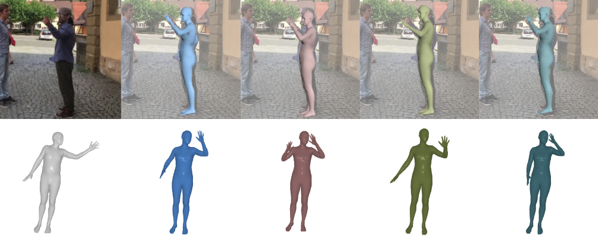

# MEGA

This repository implements the MEGA, introduced in the CVPR-2025 paper: [MEGA: Masked Generative Autoencoder for Human Mesh Recovery](https://g-fiche.github.io/research-pages/mega/).

If you find this code useful, please consider citing the associated [paper](https://g-fiche.github.io/research-pages/mega/).



This work proposes a new approach to human mesh recovery (HMR) based on masked generative modeling. By tokenizing the human pose and shape, we formulate the HMR task as generating a sequence of discrete tokens conditioned on an input image. MEGA can generate multiple outputs given a single image, which is particularly useful in challenging scenarios (as shown on the image below).


## Installation

### Create environment

    conda create -n mega python=3.9
    conda activate mega

### Install Pytorch

    conda install pytorch==2.4.0 torchvision==0.19.0 torchaudio==2.4.0 pytorch-cuda=12.4 -c pytorch -c nvidia

### Install Pytorch3D

To install Pytorch3D, we manually downloaded the conda package available [here](https://anaconda.org/pytorch3d/pytorch3d/files), and installed it with:

    conda install --use-local pytorch3d-0.7.8-py39_cu121_pyt240.tar.bz2

Another way of installing Pytorch3D is to follow the official [documentation](https://github.com/facebookresearch/pytorch3d/blob/main/INSTALL.md).

We use Pytorch3D for visualizing of meshes and for rotation transforms. If the Pytorch3D installation is not possible in your environment, one could use transforms from the [RoMa](https://naver.github.io/roma/) library and use the reprojection code in ```mega/utils/img_renderer.py``` on blank images.

### Install other dependencies

    python -m pip install -r requirements.txt


## Data

This repository relies on various external downloads in order to run the code. Here is a description of each of them.

First, we create folders to store the downloads:

    mkdir body_models
    mkdir datasets
    mkdir checkpoint

### Checkpoints

Checkpoints are available [here](https://zenodo.org/records/14974141). Download them under the ```checkpoint``` directory. The structure should look as the following:
```
${checkpoint}  
|-- CVQMAE
|   |-- mega_hrnet
|   |-- mega_resnet
|   |-- mega_vit
|-- MESH_VQVAE
|   |-- mesh_vqvae_54
|-- VQMAE
|   |-- mega_pretrained
```  


### Body models

The [SMPL-H](https://mano.is.tue.mpg.de/index.html) body model is used to obtain human meshes. To install the body model:
- Create an account on the [project-page](https://mano.is.tue.mpg.de/index.html)
- Go to the Downloads page and download the "Extended SMPL+H model (used in AMASS)". Place the downloaded smplh.tar.xz in the ```body_models``` folder and extract it.
- This should create a ```smplh``` folder. Rename the ```male``` subfolder to ```m``` and the ```female``` subfolder to ```f```.

Since MEGA is non-parametric, we need joint regressors to compute the position of body joints.
- The SMPL 24 joints regressor can be extracted from the SMPL model downloaded below as the ```J_regressor.npy```. Go to ```body_models``` and run ```unzip smplh/m/model.npz J_regressor.npy```.
- The Human3.6M joints extractor can be downloaded [here](https://github.com/open-mmlab/mmhuman3d/blob/main/docs/getting_started.md#body-model-preparation).
- Place both joint extractors under the ```body_models``` folder and rename them ```J_regressor_24.npy``` and ```J_regressor_h36m.npy```.

### Mesh-VQ-VAE

MEGA relies on a quantized representation of human meshes obtained by Mesh-VQ-VAE, a VQ-VAE architecture adapted to fixed topology human meshes.

Clone the [Mesh-VQ-VAE](https://github.com/g-fiche/Mesh-VQ-VAE) repository aside from the MEGA directory, and copy the ```mesh_vq_vae``` folder in the MEGA directory.

Follow the instructions of [Mesh-VQ-VAE](https://github.com/g-fiche/Mesh-VQ-VAE) for downloading the files associated with the fully convolutional mesh autoencoder and place them in the ```body_models``` folder.


### Pretrained backbone

The pretrained HRNet backbone can be downloaded from the original [HRNet](https://github.com/leoxiaobin/deep-high-resolution-net.pytorch) repository. Place it in the ```body_models``` folder and rename it ```pose_hrnet_w48.pth```.

For the pretrain ViT, we use the ```vitpose_backbone.pth``` that can be downloaded using the link given in the ```Training``` section of the [HMR2.0](https://github.com/shubham-goel/4D-Humans/tree/main) README. You can place this model in the ```body_models``` folder.


### Datasets

For pretraining, we use the SMPL animation files used to create the [BEDLAM](https://bedlam.is.tue.mpg.de/index.html) dataset. To download this data:
- Create an account on the [project-page](https://bedlam.is.tue.mpg.de/index.html)
- Go to the Downloads page and download ```SMPL neutral``` placed in the ```SMPL ground truth/animation files``` section.
- Extract the downloaded data in the ```dataset``` folder and rename it ```bedlam_animations```.


For the training datasets, we use the SMPL annotations provided in [Bedlam](https://bedlam.is.tue.mpg.de/index.html). Please follow the instructions [here](https://github.com/pixelite1201/BEDLAM/blob/master/docs/training.md) in the section ```Training CLIFF model with real images``` to download the training images and annotations. After download, you should have the following structure in the dataset folder:
```
${dataset}  
|-- coco
|   |-- train2014
|   |-- coco.npz
|-- mpii
|   |-- images
|   |-- mpii.npz
|-- h36m_train
|   |-- Images
|   |   |-- S1 
|   |   |-- S2 ..
|   |-- h36m_train.npz
|-- mpi-inf-3dhp
|   |-- S1
|   |-- S2 ..
|   |-- mpi_inf_3dhp_train.npz
```  

For the testing datasets, we use [3DPW](https://virtualhumans.mpi-inf.mpg.de/3DPW/) and [EMDB](https://eth-ait.github.io/emdb/):
- Download the datasets from the official websites linked above.
- Prepare the annotations npz files using the scripts available in the ```preprocess_data``` folder of [VQ-HPS](https://g-fiche.github.io/research-pages/vqhps/).


## Demo

You can run the HRNet version of MEGA on images located in the ```demo_data``` folder and save renderings in ```demo_out```:
    python demo.py


## Train

### Self-supervised pre-training

You can pre-train MEGA on motion capture data by running:

    python pretrain_mega.py

The configuration of the model used in [MEGA](https://g-fiche.github.io/research-pages/mega/) can be found under ```configs/config_vqmae/config```. 


Once the model is pre-trained, you can generate random meshes with the same script by commenting L73 and uncommenting L74-75.


### Training with images

To train MEGA on images, use:
    python traim_mega.py

The default script will train the version of MEGA using HRNet. This can be modified, by changing the ```config_name``` L28 of the script.
Configurations are available and can be modified in ```configs/config_cvqmae/```.


## Test

### Deterministic testing

MEGA can be tested in the deterministic mode using:

    python test_mega.py

The testing dataset can be modified in the config file placed in ```configs/config_cvqmae```. 

To test the ResNet and ViT models, simply change ```hrnet``` to ```resnet``` or ```vit``` in the config file name L28 of the script, and the checkpoint name L85 of the script.

### Stochastic testing

To test MEGA in the stochastic mode, comment L105 and uncomment L106. You can choose the sample size L106 of ```test_mega.py```. You then need to adjust the batch sizes in the config file. In the stochastic mode, ```train.batch=1``` and ```modelconv.batch=sample_size```.

You can then run the test with:

    python test_mega.py


## Acknowledgements

This study is part of the EUR DIGISPORT project supported by the ANR within the framework of the PIA France 2030 (ANR-18-EURE-0022). This work was performed using HPC resources from the “Mésocentre” computing center of CentraleSupélec, École Normale Supérieure Paris-Saclay, and Université Paris-Saclay supported by CNRS and Région Île-de-France.

Some code in this repository is adapted from the following repositories:
- [VQ-MAE-S](https://github.com/samsad35/VQ-MAE-S-code)
- [Pose-NDF](https://github.com/garvita-tiwari/PoseNDF/tree/version2)
- [HuMoR](https://github.com/davrempe/humor)
- [FastMETRO](https://github.com/postech-ami/FastMETRO)
- [BEDLAM](https://github.com/pixelite1201/BEDLAM)
- [T2M-GPT](https://github.com/Mael-zys/T2M-GPT)


## Citation

    @inproceedings{fiche2024vq,
        title={MEGA: Masked Generative Autoencoder for Human Mesh Recovery},
        author={Fiche, Gu{\'e}nol{\'e} and Leglaive, Simon and Alameda-Pineda, Xavier and Moreno-Noguer, Francesc},
        booktitle={IEEE/CVF Conference on Computer Vision and Pattern Recognition ({CVPR})},
        year={2025}
    }